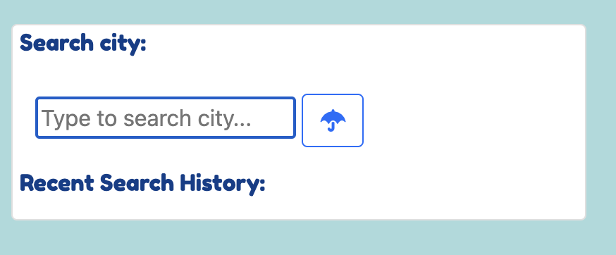
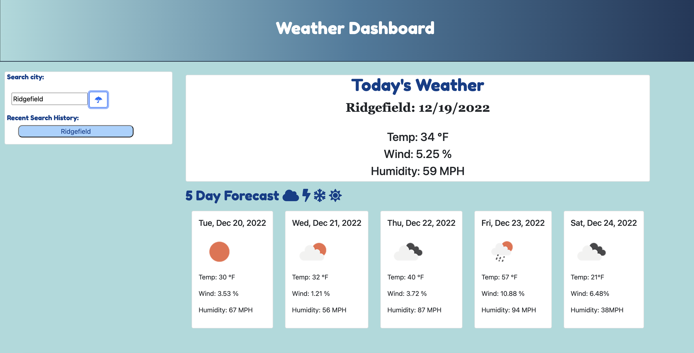
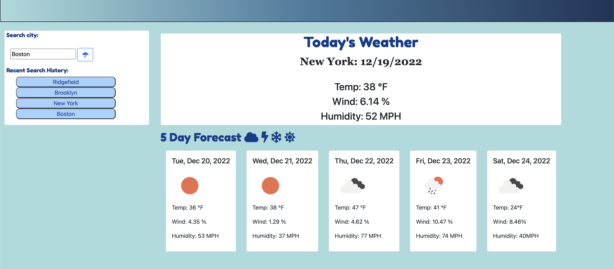

# Server-Side APIs Challenge: Weather Dashboard

## Task
Use a server side API to create a weather dashboard. When a user inputs a location, the weather for that location should be pulled into the dashboard and that previously searched location should be saved as a button for easy search. 

## User Story

```md
AS A traveler
I WANT to see the weather outlook for multiple cities
SO THAT I can plan a trip accordingly

```

## Acceptance Criteria 

```md
GIVEN a weather dashboard with form inputs
WHEN I search for a city
THEN I am presented with current and future conditions for that city and that city is added to the search history
WHEN I view current weather conditions for that city
THEN I am presented with the city name, the date, an icon representation of weather conditions, the temperature, the humidity, and the the wind speed
WHEN I view future weather conditions for that city
THEN I am presented with a 5-day forecast that displays the date, an icon representation of weather conditions, the temperature, the wind speed, and the humidity
WHEN I click on a city in the search history
THEN I am again presented with current and future conditions for that city
```

## How to Use

Start by typing your city into the search bar:


You can view your city's today forecast and five day forecast:


Your previous search should be saved in a list below the search bar:



## Link
[web page](https://analisegiobbi3.github.io/mod_6_challenge/)
